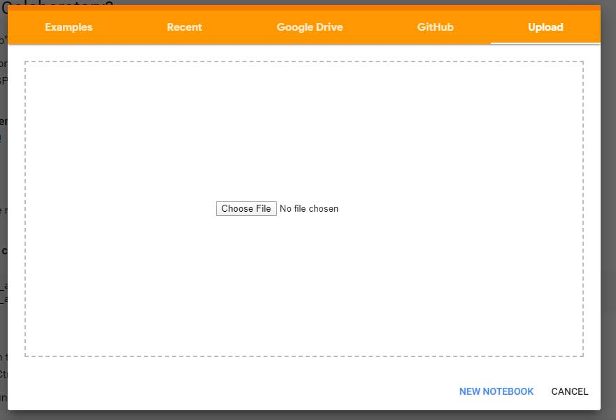
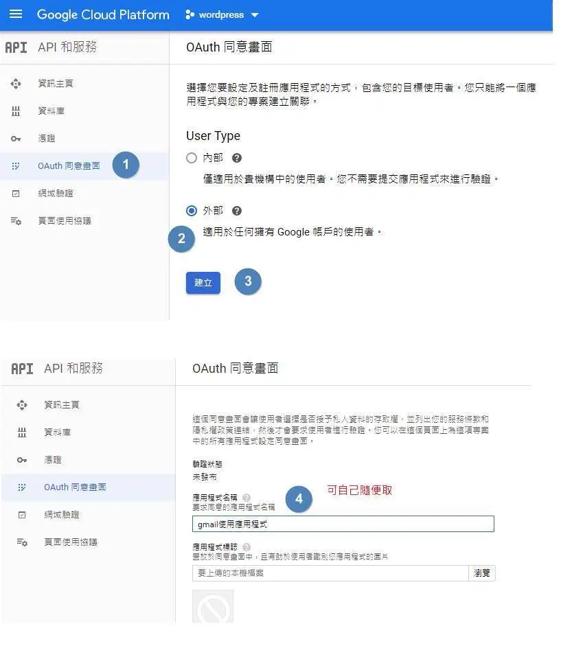
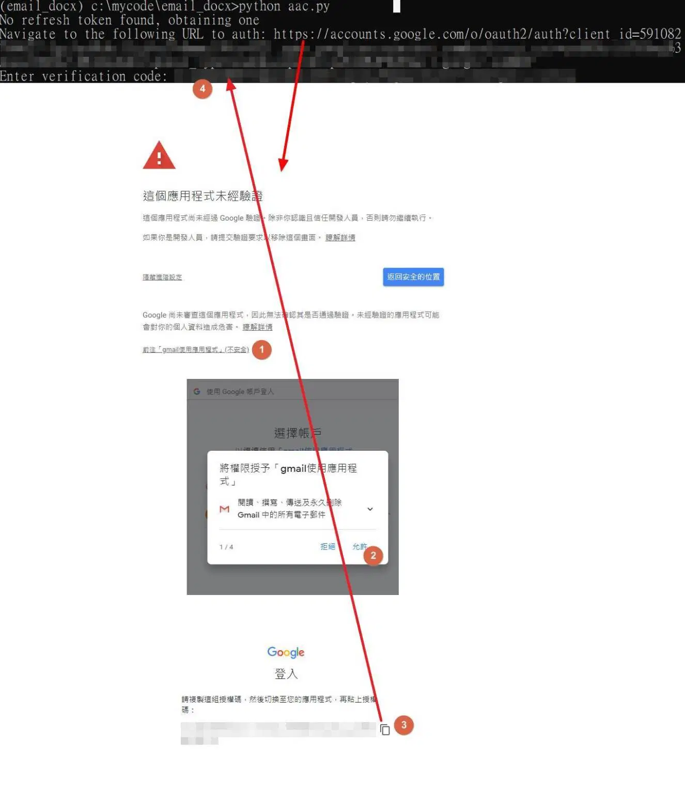
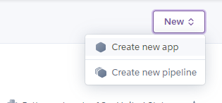
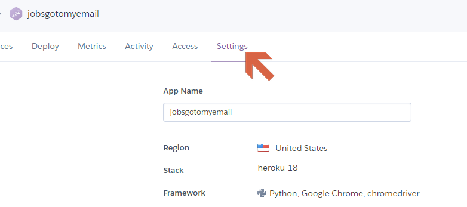
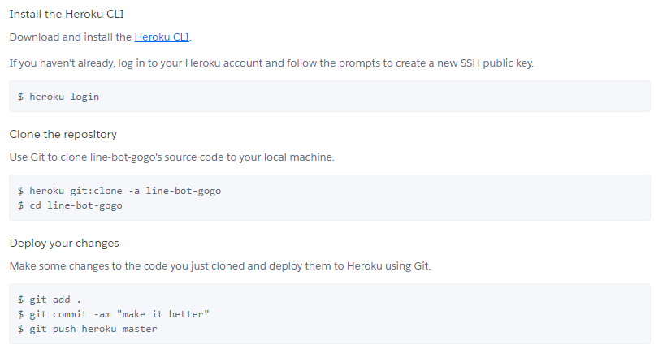
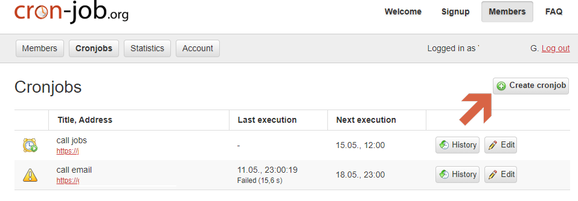
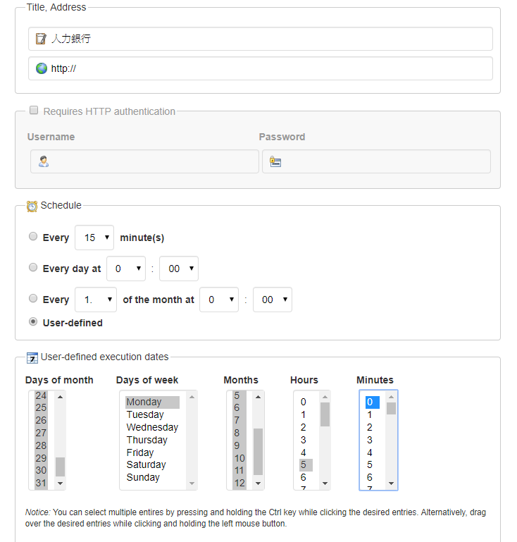

# 爬取104及1111人力銀行工作資訊

2020/6/7 更新：解決1111小改版後無法爬取

* 新增使用Heroku定時自動爬人力銀行儲存Excel檔並寄email到自己的信箱 

## 手動分為兩種版本執行
1. 本機使用版本
    * 在本機電腦上執行 請執行 Jupyter notebook  安裝指令 `pip install notebook`，建立使用Anaconda環境使用Jupyter notebook 比較不會出問題。
2. (推薦使用)google colab版[https://colab.research.google.com/](https://colab.research.google.com/)
    * (推薦使用)google colab版  
    * 將google_colab_104_1111人力銀行爬蟲.ipynb上傳 
    
    * 直接連結我的colab分享 https://colab.research.google.com/notebook#fileId=1KuaXUGgQIqJ7_ZN5V--zApt9ykOFuBk6&offline=true&sandboxMode=true

### 本機版本需求

#### 需安裝的套件
1. requests
2. beautifulsoup4
3. selenium
4. pandas
5. tqdm

`pip install requests`

`pip install beautifulsoup4`

`pip install selenium`

`pip install pandas`

`pip install tqdm`

#### ChromeDriver 選擇你的Chrome版本的Driver
https://chromedriver.chromium.org/

# 說明

從104及1111人力銀行爬取關鍵字的資料，使用Pandas接資料、清理資料、過濾篩選。

**更多說明已註解在ipynb檔案內**


## Heroku
* 爬取104 1111人力銀行篩選要的資料並儲存成Excel，寄到自己Email中。
* 自動定時寄送方法，使用[cron-job.org](https://cron-job.org/) 設定定時call Heroku，因為Heroku 30分鐘之後沒有在運作會自動進入休眠。
    * 註冊Heroku 帳號，[signup.heroku.com](https://signup.heroku.com/)

### flask使用方法
* 參數傳入  user不需要更改，這樣可以非常方便的隨時更改想要的
    * 你的heroku網址/user/金融/30000/台北市,新北市,桃園市/分析
    * 說明 
        * /user/`爬取關鍵字`/`篩選薪水多少以上`/`台北市,新北市,桃園市`/`最相關工作關鍵字`
    * 一些相關說明在app.py裡面

例如 你的網址是： `http://127.0.0.1/user/金融/30000/台北市,新北市,桃園市/分析`

### gmail api 申請設定取得oauth 2
需要使用gmail api寄送email，如果只使用google帳號密碼登入會有驗證問題無法登入導致email寄送失敗。

google api https://console.cloud.google.com/apis/


設定OAurth 同意畫面


<br>

建立憑證 OAuth


執行下列程式碼
```
"""
Adapted from:
https://github.com/google/gmail-oauth2-tools/blob/master/python/oauth2.py
https://developers.google.com/identity/protocols/OAuth2

1. Generate and authorize an OAuth2 (generate_oauth2_token)
2. Generate a new access tokens using a refresh token(refresh_token)
3. Generate an OAuth2 string to use for login (access_token)
"""

import base64
import imaplib
import json
import smtplib
import urllib.parse
import urllib.request
from email.mime.multipart import MIMEMultipart
from email.mime.text import MIMEText
import lxml.html

GOOGLE_ACCOUNTS_BASE_URL = 'https://accounts.google.com'
REDIRECT_URI = 'urn:ietf:wg:oauth:2.0:oob'

GOOGLE_CLIENT_ID = '' #在這裡輸入
GOOGLE_CLIENT_SECRET = '' #在這裡輸入
GOOGLE_REFRESH_TOKEN = None


def command_to_url(command):
    return '%s/%s' % (GOOGLE_ACCOUNTS_BASE_URL, command)


def url_escape(text):
    return urllib.parse.quote(text, safe='~-._')


def url_unescape(text):
    return urllib.parse.unquote(text)


def url_format_params(params):
    param_fragments = []
    for param in sorted(params.items(), key=lambda x: x[0]):
        param_fragments.append('%s=%s' % (param[0], url_escape(param[1])))
    return '&'.join(param_fragments)


def generate_permission_url(client_id, scope='https://mail.google.com/'):
    params = {}
    params['client_id'] = client_id
    params['redirect_uri'] = REDIRECT_URI
    params['scope'] = scope
    params['response_type'] = 'code'
    return '%s?%s' % (command_to_url('o/oauth2/auth'), url_format_params(params))


def call_authorize_tokens(client_id, client_secret, authorization_code):
    params = {}
    params['client_id'] = client_id
    params['client_secret'] = client_secret
    params['code'] = authorization_code
    params['redirect_uri'] = REDIRECT_URI
    params['grant_type'] = 'authorization_code'
    request_url = command_to_url('o/oauth2/token')
    response = urllib.request.urlopen(request_url, urllib.parse.urlencode(params).encode('UTF-8')).read().decode('UTF-8')
    return json.loads(response)


def call_refresh_token(client_id, client_secret, refresh_token):
    params = {}
    params['client_id'] = client_id
    params['client_secret'] = client_secret
    params['refresh_token'] = refresh_token
    params['grant_type'] = 'refresh_token'
    request_url = command_to_url('o/oauth2/token')
    response = urllib.request.urlopen(request_url, urllib.parse.urlencode(params).encode('UTF-8')).read().decode('UTF-8')
    return json.loads(response)


def generate_oauth2_string(username, access_token, as_base64=False):
    auth_string = 'user=%s\1auth=Bearer %s\1\1' % (username, access_token)
    if as_base64:
        auth_string = base64.b64encode(auth_string.encode('ascii')).decode('ascii')
    return auth_string


def test_imap(user, auth_string):
    imap_conn = imaplib.IMAP4_SSL('imap.gmail.com')
    imap_conn.debug = 4
    imap_conn.authenticate('XOAUTH2', lambda x: auth_string)
    imap_conn.select('INBOX')


def test_smpt(user, base64_auth_string):
    smtp_conn = smtplib.SMTP('smtp.gmail.com', 587)
    smtp_conn.set_debuglevel(True)
    smtp_conn.ehlo('test')
    smtp_conn.starttls()
    smtp_conn.docmd('AUTH', 'XOAUTH2 ' + base64_auth_string)


def get_authorization(google_client_id, google_client_secret):
    scope = "https://mail.google.com/"
    print('Navigate to the following URL to auth:', generate_permission_url(google_client_id, scope))
    authorization_code = input('Enter verification code: ')
    response = call_authorize_tokens(google_client_id, google_client_secret, authorization_code)
    return response['refresh_token'], response['access_token'], response['expires_in']


def refresh_authorization(google_client_id, google_client_secret, refresh_token):
    response = call_refresh_token(google_client_id, google_client_secret, refresh_token)
    return response['access_token'], response['expires_in']


def send_mail(fromaddr, toaddr, subject, message):
    access_token, expires_in = refresh_authorization(GOOGLE_CLIENT_ID, GOOGLE_CLIENT_SECRET, GOOGLE_REFRESH_TOKEN)
    auth_string = generate_oauth2_string(fromaddr, access_token, as_base64=True)

    msg = MIMEMultipart('related')
    msg['Subject'] = subject
    msg['From'] = fromaddr
    msg['To'] = toaddr
    msg.preamble = 'This is a multi-part message in MIME format.'
    msg_alternative = MIMEMultipart('alternative')
    msg.attach(msg_alternative)
    part_text = MIMEText(lxml.html.fromstring(message).text_content().encode('utf-8'), 'plain', _charset='utf-8')
    part_html = MIMEText(message.encode('utf-8'), 'html', _charset='utf-8')
    msg_alternative.attach(part_text)
    msg_alternative.attach(part_html)
    server = smtplib.SMTP('smtp.gmail.com:587')
    server.ehlo(GOOGLE_CLIENT_ID)
    server.starttls()
    server.docmd('AUTH', 'XOAUTH2 ' + auth_string)
    server.sendmail(fromaddr, toaddr, msg.as_string())
    server.quit()


if __name__ == '__main__':
    if GOOGLE_REFRESH_TOKEN is None:
        print('No refresh token found, obtaining one')
        refresh_token, access_token, expires_in = get_authorization(GOOGLE_CLIENT_ID, GOOGLE_CLIENT_SECRET)
        print('Set the following as your GOOGLE_REFRESH_TOKEN:', refresh_token)
        exit()

    send_mail('--------@gmail.com', '--------@gmail.com',
              'A mail from you from Python',
              'A mail from you from Python' +
              'So happy to hear from you!')
```

TOKEN使用方法
將你的ID、SECRET 輸入到上方的腳本並執行，進入產生的網址，依照圖步驟走下去。



json檔設定,開啟oauth2_creds.json
將由上面取得的id、secret、token 輸入至json檔。
```
{
    "google_refresh_token": "token",
    "google_client_secret": "secret": 
    "google_client_id": "id"
} 
```

### 過濾 關鍵詞 地區設定
編輯email_find.py
滑動到最底部

設定需要的薪資、縣市、相關的工作關鍵字，也可以新增更多條件判斷
```
mask1 = concat_104_1111.薪資 >= 30000
mask2 = concat_104_1111.地區.str.contains('台北市')
mask3 = concat_104_1111.地區.str.contains('新北市')
mask4 = concat_104_1111.地區.str.contains('桃園市')
mask5 = concat_104_1111.工作名稱.str.contains('分析師')
```

將 收件人信箱 設定你的email
```
# 將工作資訊寄給自己gmail
file = glob.glob('jobs_csv/*.xlsx') #傳送多個檔案 以list型態
yag = yagmail.SMTP("你的email", oauth2_file="oauth2_creds.json")
yag.send(
    to="你的email", subject="爬蟲：熱騰騰的工作資訊", #to = "收件人信箱" 需傳送多個 使用list ['aaaa@123.com', 'bbb@123.com']
    contents="熱騰騰的工作資料",
    attachments= file
    )
```

### 前置設定
#### 建立一個APP



#### 設定 環境變數、chrome、chromedriver


* `heroku/python`
* `https://github.com/heroku/heroku-buildpack-google-chrome`
* `https://github.com/heroku/heroku-buildpack-chromedriver`


`CHROMEDRIVER_PATH` `/app/.chromedriver/bin/chromedriver`

`GOOGLE_CHROME_BIN` `/app/.apt/usr/bin/google-chrome`


#### 上傳
將heroku內全部上傳，需先安裝 Heroku CLI https://devcenter.heroku.com/articles/heroku-cli

選擇Deploy


開啟Command Prompt命令 或 使用 vs code 或其他可執行指令的Command Prompt
輸入
* `heroku login`
* `heroku git:clone -a line-bot-gogo`
* `cd Heroku` 切換到要上傳的的資料夾，Heroku
* `git add .`
* ` git commit -am "make it better" `
* ` git push heroku master `



上傳完成後可以看到網址，或到Heroku app內的Settings查看

#### cron-job 設定
網址部分請至[flask使用方法看](#flask使用方法)看

例如 你的網址是： `http://127.0.0.1/user/金融/30000/台北市,新北市,桃園市/分析`

注意需使用編碼：例如：`http://127.0.0.1/user/%E9%87%91%E8%9E%8D/30000/%E5%8F%B0%E5%8C%97%E5%B8%82,%E6%96%B0%E5%8C%97%E5%B8%82,%E6%A1%83%E5%9C%92%E5%B8%82/%E5%88%86%E6%9E%90`

如何轉碼
===
將網址貼在chrome上在剪下並貼上到記事本,chrome本身會自動轉碼


[註冊cron-job.org/en/signup/](https://cron-job.org/en/signup/)





days of month 需要call的日期
days of week 一周內要call幾天 
months 月份
Hours 小時
minutes 分

圖中設定為 每周禮拜一固定 AM 5:00 Call


